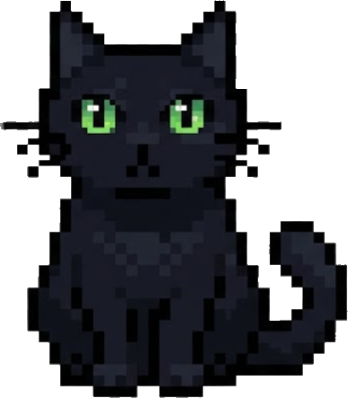

# 🐈‍⬛ Desktop Cat

An autonomous **pixel-art desktop cat** that lives on your screen.
Written in pure Python with `tkinter` + `Pillow`.



## ✨ What it does

- 🚶 **Walks** left and right along the bottom of your screen (standing and on all fours).
- 👀 **Follows your mouse** — the cat turns toward the cursor and its pupils track it.
- ⌨️ **Reacts to typing** — taps its paws and shows a `тык-тык!` bubble while you type *(needs `pynput`)*.
- 🪟 **Always on top** of every window.
- 🧗 **Climbs onto your open windows and scratches them**, then…
- 💩 **Poops a 💩 emoji** on the screen after scratching.
- 😴 **Sleeps** with `z z z`.
- 🖱️ **Draggable** — grab it with the mouse and it stretches like mochi.
- 📋 **Right-click menu**: Walk / Sleep / Scratch a window / Poop / Quit.

## 📦 Install

```bash
pip install pillow pynput
```

- `pillow` — required (sprite rendering).
- `pynput` — optional, enables the typing reaction. Without it the cat still works, just won't react to your keyboard.

## ▶️ Run

```bash
python cat.py
```

Keep `cat.py` together with all the `cat_*.png` sprite files in the same folder.

## 🎮 Controls

| Action | What happens |
|---|---|
| **Double-click** | Cat goes for a walk |
| **Drag** | Pick the cat up (mochi stretch) |
| **Right-click** | Menu: Walk / Sleep / Scratch a window / Poop / Quit |

## 🗂️ Sprites

| File | Pose |
|---|---|
| `cat.png` | sitting (base) |
| `cat_stand.png` | standing |
| `cat_walk.png` | walking on all fours (side) |
| `cat_walkf.png` | front walk |
| `cat_stretch.png` | stretching (shown while dragged) |
| `cat_scratch.png` | scratching |
| `cat_play.png` | playing |
| `cat_sleep.png` | sleeping |
| `cat_type.png` | at the keyboard (typing) |

## ⚠️ Notes

- **Window climbing & scratching and the 💩 emoji are Windows-only** (they use the Win32 API to find your open windows). On other systems the cat falls back to scratching in place.
- On multi-monitor or high-DPI setups the climb position may be slightly off — open an issue if it misbehaves.
- The 💩 uses the *Segoe UI Emoji* font (ships with Windows) so it renders in color.

## 🛠️ Requirements

- Python 3.8+
- Windows (recommended for all features); core pet works cross-platform.

## 📄 License

MIT — see [LICENSE](LICENSE).
